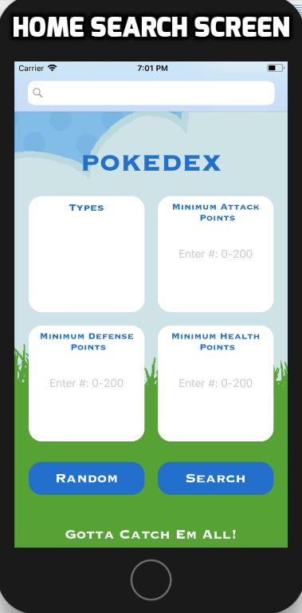
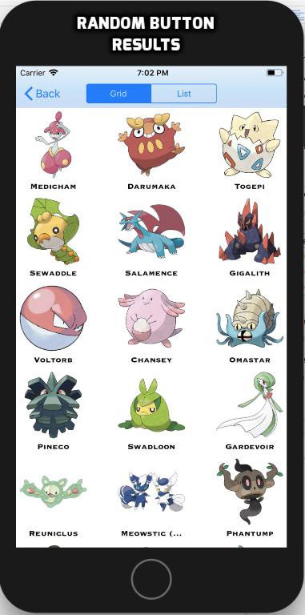

# Pokedex

There are currently 807 pokemons in existence. However, is it difficult to keep track of all these Pokemons. With Pokedex, it is easy to do so! Pokedex is a friendly to use app that allows users to get information about all these pokemons.

Users can search Pokemons by type and attributes such as maximum health points. Each pokemon has a profile page that includes statistics such as their speed, id, and attack points. Users can also search for pokemons, generate a random list of 20 pokemons, and add certain pokemons to their favorites.

If users want more information about a pokemon, the app easily directs the user to the web to get more information about a pokemon. Overall, the app is for Pokemon lovers or anyone who wants to get a glimpse into the Pokemon world!

|         |            |   |
| :-------------: | :-------------: | :-------------: |
| Search Screen | Random Result Button | Profile Page |

## Acknowledgements
* MDB iOS Instructors/Mentors Max Miranda, Will Oakley, Shubham Gupta
* Created by Vaibhav Gattani & Kiana Go

